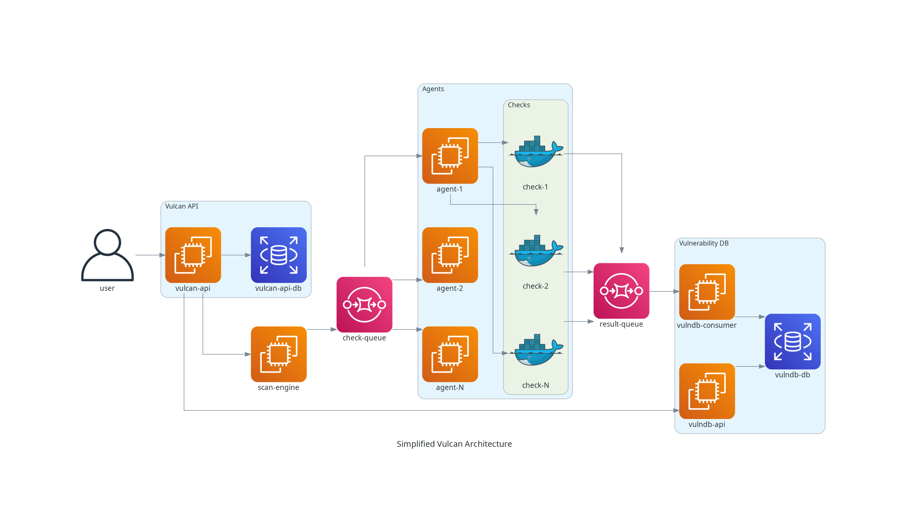
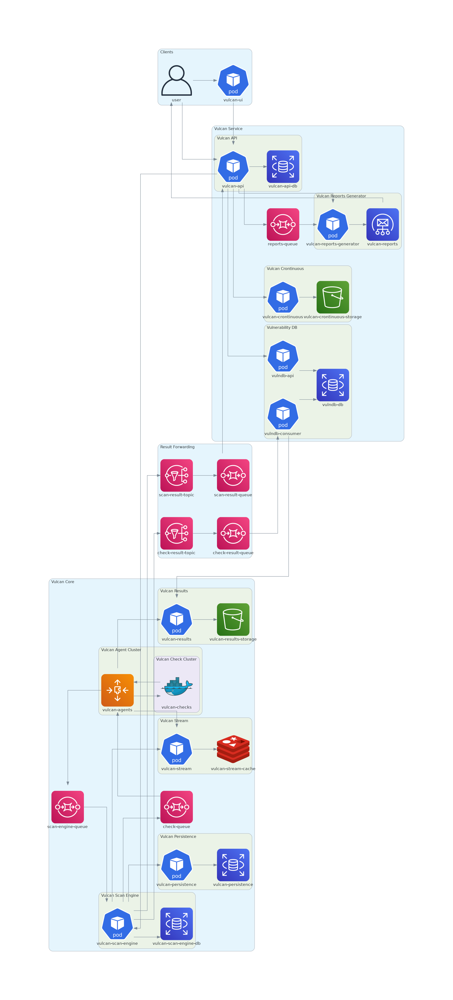

# Architecture

## Simplified Architecture

This diagram shows the essential communication flow of Vulcan.

The main elements shown in the diagram are the following:

- [Vulcan API](https://github.com/adevinta/vulcan-api/): Manage teams, assets, users, scan policies and programs.
- [Scan Engine](https://github.com/adevinta/vulcan-scan-engine): Creates checks on a schedule following scan programs.
- [Agents](https://github.com/adevinta/vulcan-agent): Execute, monitors and manage checks. Process and store results.
- [VulnDB Consumer](https://github.com/adevinta/vulnerability-db): Processes and stores results from checks on a timeline.
- [VulnDB API](https://github.com/adevinta/vulnerability-db-api): Provides access to catalogued issues, findings and statistics.

Notably absent from this diagram are the following elements:

- User interfaces such as the [Vulcan UI](https://github.com/adevinta/vulcan-ui), the [Vulcan Core CLI](https://github.com/adevinta/vulcan-core-cli), [Vulcan Local](https://github.com/adevinta/vulcan-local/)...
- Communication performed by specific checks requiring third-party services.
- Network devices (balancers, proxies, gateways...) necessary for communication.
- Simple microservices ([result storage](https://github.com/adevinta/vulcan-results), [check inventory](https://github.com/adevinta/vulcan-persistence), [metrics](https://github.com/adevinta/vulcan-metrics)...) used for specific tasks.
- [WebSocket stream](https://github.com/adevinta/vulcan-stream) for pushing commands (abort, scale...) from scan engine to the agents.
- Specific runtimes (e.g. AWS, Kubernetes, GCP...) that the components can run inside of.

For a detailed list of all the components involved in Vulcan, see the [repositories](/repositories/) page.

## Detailed Architecture

This diagram shows a detailed architecture of Vulcan working in Kubernetes and AWS.

