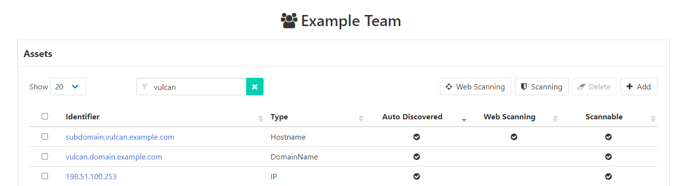
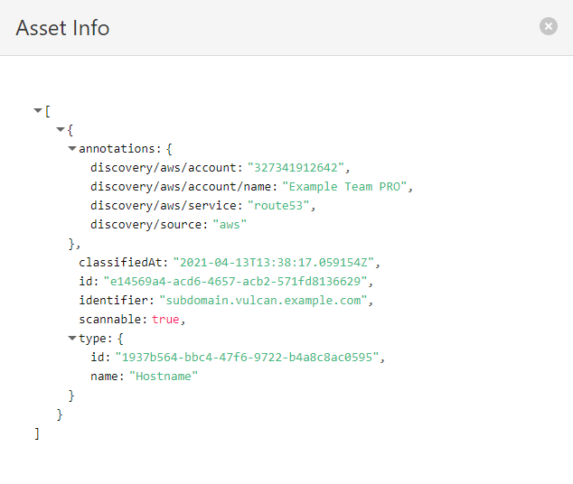

# Asset Auto-Discovery

Through its various interfaces, Vulcan can be connected to any external process that is able to discover assets. The Vulcan API has a discovery endpoint designed specifically for this. Vulcan can store and provide context to users about how specific assets were discovered. This allows users to simply add their main assets (e.g. an AWS account) manually in Vulcan and allow the external discovery process to use them to detect other assets that belong to the same team (e.g. EC2 instances, RDS databases...). Other examples include automatically onboarding assets into Vulcan whenever they are deployed (by calling the Vulcan API in the deployment process) or using an external asset inventory to keep the assets in Vulcan up to date.

## Examples

<figure markdown>
  
  <figcaption>Assets that have been auto-discovered in the Vulcan web interface.</figcaption>
</figure>

<figure markdown>
  
  <figcaption>Auto-discovery metadata for an asset in the Vulcan web interface.</figcaption>
</figure>
