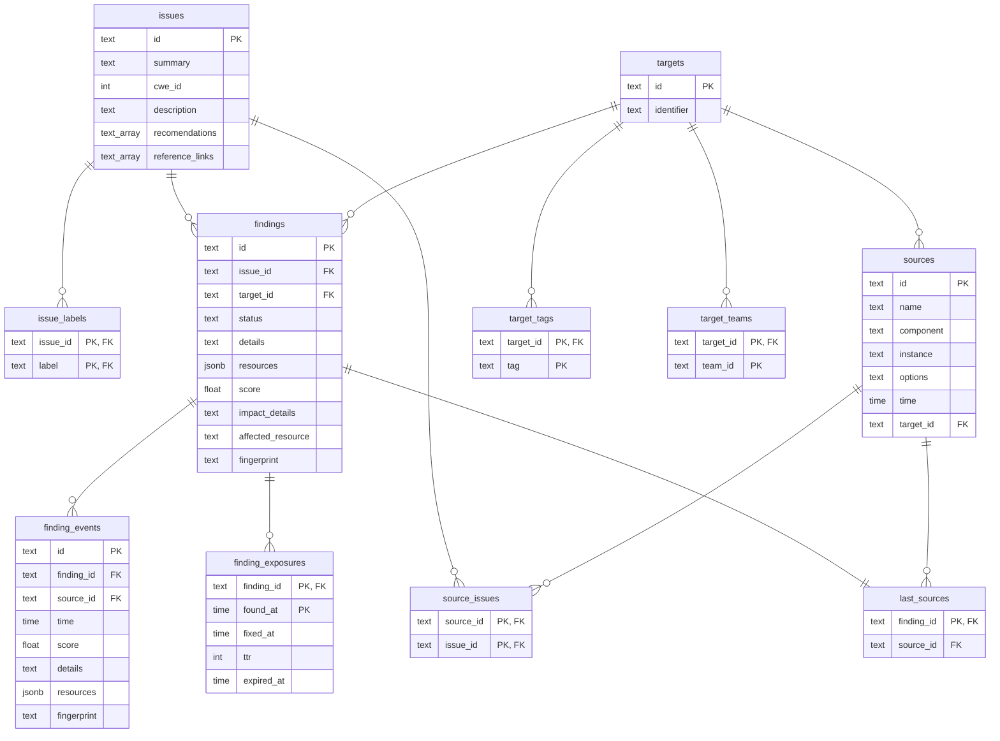
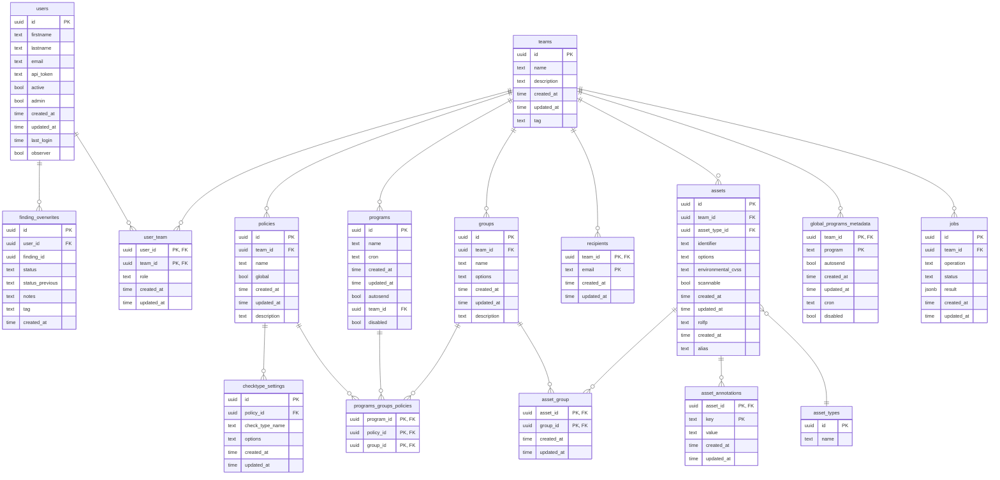
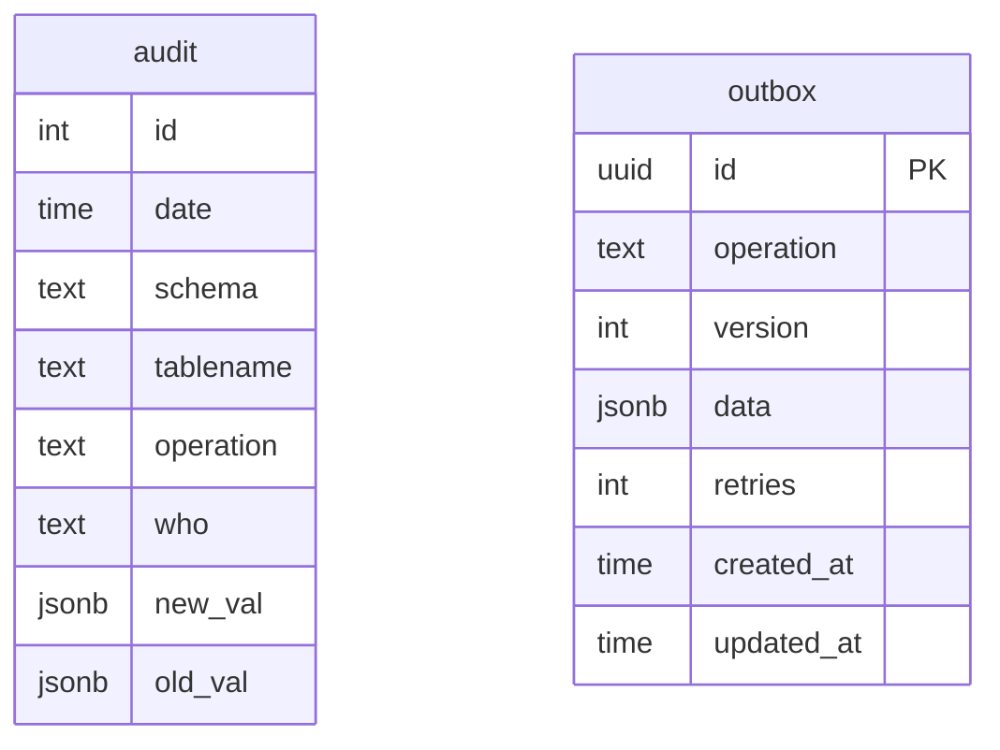

---
hide:
  - toc
---

# Data Models

## Vulnerability DB

```mermaid
erDiagram
    issues {
        text id "PK"
        text summary
        int cwe_id
        text description
        text_array recomendations
        text_array reference_links 
    }
    issue_labels {
        text issue_id "PK, FK"
        text label "PK, FK"
    }
    findings {
        text id "PK"
        text issue_id "FK"
        text target_id "FK"
        text status
        text details
        jsonb resources
        float score
        text impact_details
        text affected_resource
        text fingerprint
    }
    finding_events {
      text id "PK"
      text finding_id "FK"
      text source_id "FK"
      time time
      float score
      text details
      jsonb resources
      text fingerprint
    }
    finding_exposures {
      text finding_id "PK, FK"
      time found_at "PK"
      time fixed_at
      int ttr
      time expired_at
    }
    sources {
      text id "PK"
      text name
      text component
      text instance
      text options
      time time
      text target_id "FK"
    }
    source_issues {
      text source_id "PK, FK"
      text issue_id "PK, FK"
    }
    last_sources {
      text finding_id "PK, FK"
      text source_id "FK"
    }
    targets {
      text id "PK"
      text identifier
    }
    target_tags {
      text target_id "PK, FK"
      text tag "PK"
    }
    target_teams {
      text target_id "PK, FK"
      text team_id "PK"
    }
    targets ||--o{ target_tags : ""
    targets ||--o{ target_teams : ""
    targets ||--o{ findings : ""
    targets ||--o{ sources : ""
    sources ||--o{ source_issues : ""
    sources ||--o{ last_sources : ""
    issues ||--o{ source_issues : ""
    issues ||--o{ findings : ""
    issues ||--o{ issue_labels : ""
    findings ||--o{ finding_events : ""
    findings ||--o{ finding_exposures : ""
    findings ||--|| last_sources : ""
```

## Vulcan API

```mermaid
erDiagram
    teams {
        uuid id "PK"
        text name
        text description
        time created_at
        time updated_at
        text tag
    }
    user_team {
        uuid user_id "PK, FK"
        uuid team_id "PK, FK"
        text role
        time created_at
        time updated_at
    }
    users {
        uuid id "PK"
        text firstname
        text lastname
        text email
        text api_token
        bool active
        bool admin
        time created_at
        time updated_at
        time last_login
        bool observer
    }
    finding_overwrites {
      uuid id "PK"
      uuid user_id "FK"
      uuid finding_id
      text status
      text status_previous
      text notes
      text tag
      time created_at
    }
    recipients {
        uuid team_id "PK, FK"
        text email "PK"
        time created_at
        time updated_at
    }
    assets {
        uuid id "PK"
        uuid team_id "FK"
        uuid asset_type_id "FK"
        text identifier
        text options
        text environmental_cvss
        bool scannable
        time created_at
        time updated_at
        text rolfp
        time created_at
        text alias
    }
    asset_annotations {
        uuid asset_id "PK, FK"
        text key "PK"
        text value
        time created_at
        time updated_at
    }
    asset_types {
        uuid id "PK"
        text name
    }
    asset_group {
        uuid asset_id "PK, FK"
        uuid group_id "PK, FK"
        time created_at
        time updated_at
    }
    groups {
        uuid id "PK"
        uuid team_id "FK"
        text name
        text options
        time created_at
        time updated_at
        text description
    }
    policies {
        uuid id "PK"
        uuid team_id "FK"
        text name
        bool global
        time created_at
        time updated_at
        text description
    }
    checktype_settings {
        uuid id "PK"
        uuid policy_id "FK"
        text check_type_name
        text options
        time created_at
        time updated_at
    }
    programs {
        uuid id "PK"
        text name
        text cron
        time created_at
        time updated_at
        bool autosend
        uuid team_id "FK"
        bool disabled
    }
    programs_groups_policies {
        uuid program_id "PK, FK"
        uuid policy_id "PK, FK"
        uuid group_id "PK, FK"
    }
    global_programs_metadata {
        uuid team_id "PK, FK"
        text program "PK"
        bool autosend
        time created_at
        time updated_at
        text cron
        bool disabled
    }
    jobs {
      uuid id "PK"
      uuid team_id "FK"
      text operation
      text status
      jsonb result
      time created_at
      time updated_at
    }
    teams ||--o{ user_team : ""
    teams ||--o{ policies : ""
    teams ||--o{ programs : ""
    teams ||--o{ groups : ""
    teams ||--o{ recipients : ""
    teams ||--o{ assets : ""
    teams ||--o{ global_programs_metadata : ""
    teams ||--o{ jobs : ""
    users ||--o{ finding_overwrites : ""
    users ||--o{ user_team : ""
    assets ||--o{ asset_group : ""
    assets ||--o{ asset_annotations : ""
    assets }o--|| asset_types : ""
    policies ||--o{ checktype_settings : ""
    policies ||--o{ programs_groups_policies : ""
    programs ||--o{ programs_groups_policies : ""
    groups ||--o{ programs_groups_policies : ""
    groups ||--o{ asset_group : ""
```

```mermaid
erDiagram
    audit {
        int id
        time date
        text schema
        text tablename
        text operation
        text who
        jsonb new_val
        jsonb old_val
    }
    outbox {
        uuid id "PK"
        text operation
        int version
        jsonb data
        int retries
        time created_at
        time updated_at
    }
```
