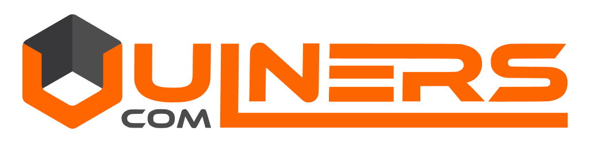

# Vulcan

Vulcan is a security scanning management, orchestration and reporting platform.

## Goal 

Allow teams to be independent in managing the security of their assets while reducing the toil associated with doing so. Allow security teams to focus on security instead of operations.

## Features

- Single platform to consolidate all security scanning methods and asset types.
- Adapt any security tool (commercial, open source, custom...) to run on a large scale.
- Scan assets like servers, networks, Docker images, Git repositories, AWS accounts and more.
- Completely automated periodic scanning and reporting workflow for continuous scanning.
- Tooling to easily integrate most of the available security checks in the CI/CD process.
- Team tenancy to allow users to directly manage their security without intermediaries.
- Useful metrics such as critical assets, median exposure or mean time to remediate.
- Endless integration possibilities using the many available interfaces: UI, API, CLI, queues...
- Existing library of over 40 adapted and fine tuned security tools and custom checks. 

## Highlighted Integrations

{: style="height:80px;margin:10px"} 
{: style="height:80px;margin:10px"} 
{: style="height:80px;margin:10px"} 
{: style="height:80px;margin:10px"} 
{: style="height:80px;margin:10px"} 
{: style="height:80px;margin:10px"} 
{: style="height:80px;margin:10px"} 
{: style="height:80px;margin:10px"} 
{: style="height:80px;margin:10px"} 
